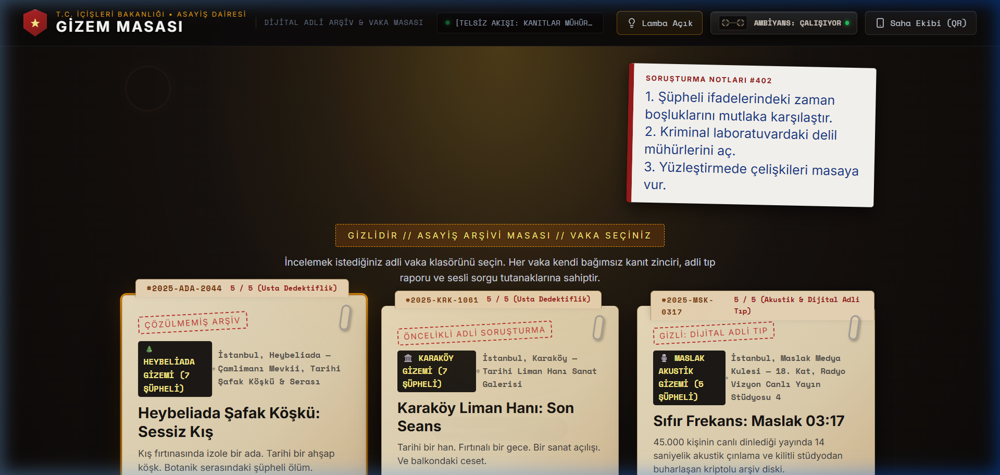
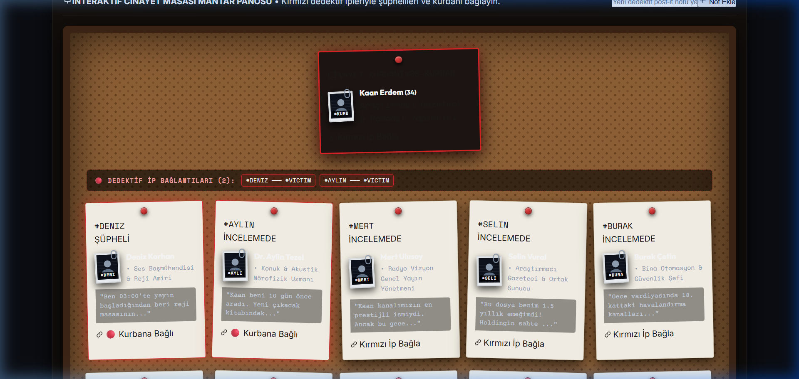

# 🕵️‍♂️ Gizem Masası (Mystery Desk) — AI-Assisted Interactive Detective Web Platform

> **Canlı Yayında Deneyimle:** [https://gizem-masasi-dedektif.vercel.app/](https://gizem-masasi-dedektif.vercel.app/)  
> **Geliştirici:** Burak Şenol  
> **Odak:** İnteraktif Durum Yönetimi, Adli Mantık Kurgusu & AI Destekli Hızlı Prototipleme

---

## 🔒 Gizlilik & Oyun Bütünlüğü Bildirimi (Confidentiality Notice)

> [!NOTE]
> Bu depo, projenin **mühendislik vaka analizi (Engineering Case Study)** ve mimari vitrini olarak sunulmaktadır.  
> Oyuncuların dedektiflik deneyimini, bulmaca akışını ve adli tıp vaka sürprizlerini (spoilers) korumak amacıyla ham senaryo çözüm anahtarları ve veritabanı yanıt matrisleri bu genel depoda kapalı tutulmuştur. Projenin çalışan tüm mekaniklerini, ses ve arayüz etkileşimlerini [gizem-masasi-dedektif.vercel.app](https://gizem-masasi-dedektif.vercel.app/) adresinden canlı olarak deneyimleyebilirsiniz.

---

## 📌 Projeye Genel Bakış (Executive Summary)

**Gizem Masası**, oyuncuları bir dedektif masasına oturtarak karmaşık adli vakaları, zaman damgalı tanık ifadelerini, kriminal laboratuvar delillerini ve ses kayıtlarını analiz ettiren interaktif bir web simülasyonudur.

Bu projenin temel mühendislik hedefi; modern üretken yapay zeka (LLM) araçlarını bir yazılım geliştirici için **aktif bir üretim ortağı ve hızlandırıcı** olarak konumlandırarak, fikir aşamasından responsive ve canlı web ürününe kadar uçtan uca hızlı prototipleme metodolojisini test etmek ve başarıyla uygulamaktır.

---

## 📸 Arayüz & Görseller

  
   
  <em>Dedektiflik Masası: Kriminal Dosyalar, Delil Zarfları ve Vaka Seçimi</em>

  
   
  <em>İnteraktif Mantar Pano: Şüpheliler, Zaman Çizgileri ve Mantıksal Çıkarım Ağı</em>

---

## ⚙️ Öne Çıkan Mühendislik & Mimari Detayları

### 1. 🧩 Dinamik Çelişki Algılama Matrisi (Contradiction Logic Engine)
* Şüphelilerin ifadelerindeki zaman damgaları, mekansal iddialar ve adli tıp otopsi/DNA raporları arasında çapraz doğrulama yapan kural tabanlı çıkarım motoru.
* Oyuncunun doğru delil ile doğru tanık ifadesini eşleştirmesini denetleyen dinamik durum (state) mimarisi.

### 2. 📌 İnteraktif Mantar Pano & Çıkarım Ağı
* Fiziksel bir dedektif mantar panosu hissi veren; şüpheli portreleri, post-it notlar, 3D kırmızı raptiyeler ve bağlantı iplikleri simülasyonu.
* CSS Transform ve DOM manipülasyonu ile kurgulanmış akıcı ve duyarlı (responsive) görsel deneyim.

### 3. 🎙️ Siber-Akustik Darbe & Ses Dalga Formu Simülasyonu
* Gerçek zamanlı frekans dalgalanması (audio waveform visualizer) animasyonları.
* Canlı yayın siber-saldırı panik sohbeti (45.000 eşzamanlı izleyici simülasyonu) ve kriptolu SSD log çözümleme akışı.

### 4. ⚖️ Kriminal Mahkeme Kararı & Puanlama Motoru
* 100 puan üzerinden ağırlıklı değerlendirme: Katil tespiti, kritik çelişki yakalama ve adli delil sunumu doğruluk algoritmaları.
* Karar anında beliren resmi mahkeme mührü ve dinamik dava raporu dökümü.

---

## 🛠️ Teknoloji Yığını (Tech Stack)

| Katman | Teknolojiler |
| :--- | :--- |
| **Frontend Mimari** | React, Modern JavaScript, CSS3 Custom Properties |
| **Arayüz & Etkileşim** | Responsive UI/UX, CSS Grid/Flexbox, Keyframe Micro-Animations |
| **Metodoloji** | Prompt Engineering, Generative AI Pair-Programming, Iterative Prototyping |
| **Dağıtım & CDN** | Vercel Edge Platform, SSL, Sub-Second Edge Delivery |

---

## 🎮 Canlı Vakalar
* 🌲 **Heybeliada Şafak Köşkü:** 1950'ler kış fırtınasında botanik araştırmacısı cinayeti.
* 🎨 **Karaköy Liman Hanı:** Yağmurlu bir sergi gecesi ve sahte tablo şantaj ağı.
* 🎙️ **Sıfır Frekans: Maslak 03:17:** Canlı podcast yayınında siber-akustik darbe ve kayıp kriptolu SSD.

---

## 👨‍💻 Geliştirici & İletişim

**Burak Şenol**  
Düzce Üniversitesi Bilgisayar Mühendisliği 4. Sınıf Öğrencisi  
* **Canlı Proje:** [gizem-masasi-dedektif.vercel.app](https://gizem-masasi-dedektif.vercel.app/)  
* **LinkedIn:** [linkedin.com/in/burak-senol](https://linkedin.com/in/burak-senol)  
* **GitHub:** [github.com/burak-senol-dev](https://github.com/burak-senol-dev)  
* **E-Posta:** [buraksenol10@gmail.com](mailto:buraksenol10@gmail.com)